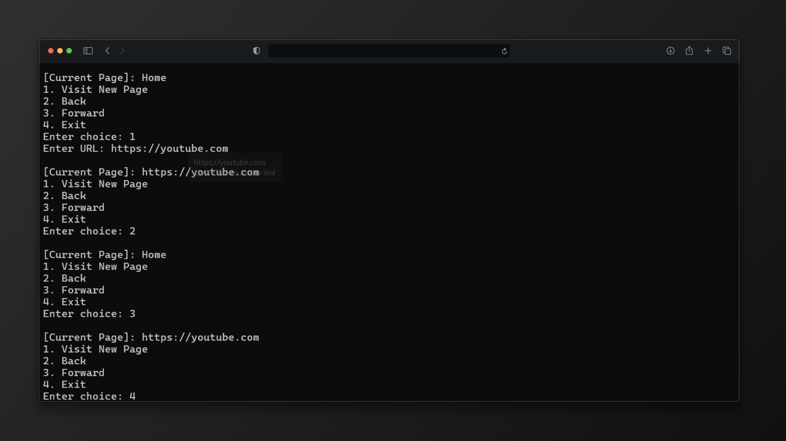

<div align="center">

  

  # 🌐 Browser History Tracker
  
  **A C simulation of web navigation using the Stack Data Structure.**

  <!-- Badges -->
  <p>
    
    
    
  </p>

</div>

## 📖 Overview
This project simulates the core **Back** and **Forward** button functionality of a web browser. It utilizes the **Stack (Last-In, First-Out)** data structure to efficiently manage navigation history.

By implementing a **Dual-Stack Architecture**, the system ensures that users can traverse their browsing history seamlessly.

---

## 🏗️ Architecture

| Component | Functionality |
| :--- | :--- |
| **Back Stack** | Stores the history of pages visited before the current one. |
| **Forward Stack** | Stores pages that were popped from the Back Stack (allows "Redo" navigation). |
| **Current Page** | A string variable holding the active URL. |

---

## 🚀 Features

*   **Visit New Page:** Adds current page to history and clears forward history.
*   **Go Back:** Returns to the previous page using LIFO logic.
*   **Go Forward:** Returns to the page you just came back from.
*   **Validation:** Prevents navigation if stacks are empty.

---

## 💻 Output Screenshot

<div align="center">
  <!-- Replace with your actual screenshot -->
  <a href="assets/output.png" target="_blank">
    
  </a>
</div>

---

## 🛠️ How to Run

1.  **Compile:**
    ```bash
    gcc -Iinclude src/stack.c src/main.c -o browser_tracker
    ```

2.  **Run:**
    ```bash
    ./browser_tracker.exe
    ```

## 👨‍💻 Author
**MOHAMMED ANSHAF A**  
*Department of Computer Science&Engineering*
